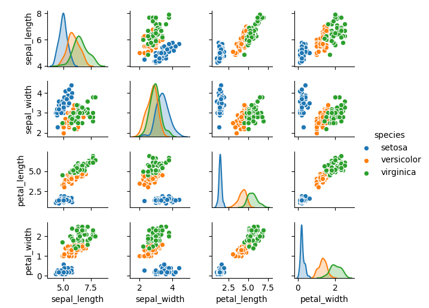
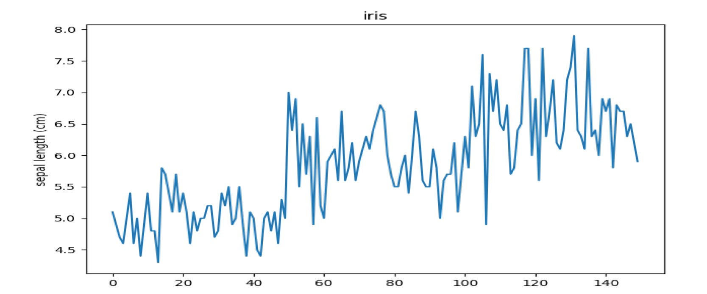

# Documentation structure

- [machine learning introduction](#machine-learning-introduction)  
  - [Supervised learning](#supervised-learning)  
  - [labeled dataset examples](#labeled-dataset-examples)  
  - [Unsupervised learning](#unsupervised-learning)  
  - [Clustering](#clustering)  
  - [Classification](#classification)  
  - [machine learning model](#machine-learning-model)  
  - [k-Fold Cross-Validation](#k-fold-cross-validation)  
  - [Signal vs Noise](#signal-vs-noise)  
  - [Model fitting](#model-fitting)  
  - [Overfitting](#overfitting)  
  - [How to Detect Overfitting](#how-to-detect-overfitting)  
  - [k-Fold Cross-Validation and overfitting](#k-fold-cross-validation-and-overfitting)  
  - [How to Prevent Overfitting](#how-to-prevent-overfitting)  
- [machine learning algorithms](#machine-learning-algorithms)
  - [LinearSVC](#linearsvc)
  - [Support vector classifier](#support-vector-classifier)
  - [k-nearest neighbors](#k-nearest-neighbors)
  - [DBSCAN](#dbscan)
  - [k-means clustering](#k-means-clustering)
- [Introduction to arrays using numpy](#introduction-to-arrays-using-numpy)    
- [visualize a dataset using seaborn](#visualize-a-dataset-using-seaborn)  
- [manipulate dataset with pandas](#manipulate-dataset-with-pandas)  
- [iris flowers classification](#iris-flowers-classification)
  - [iris flowers data set](#iris-flowers-data-set)  
  - [Load the dataset](#load-the-dataset)
  - [Examine the dataset](#examine-the-dataset)
  - [Graph the data set](#graph-the-data-set)
  - [Select an algorithm](#select-an-algorithm)
  - [measure the performance of prediction](#measure-the-performance-of-prediction)
    - [split randomly the data set into a train and a test subset](#split-randomly-the-data-set-into-a-train-and-a-test-subset)
    - [Fit the model](#fit-the-model)
    - [Evaluate the trained model performance](#evaluate-the-trained-model-performance)
    - [Use k-Fold Cross-Validation to better evaluate the trained model performance](#use-k-Fold-cross-validation-to-better-evaluate-the-trained-model-performance)
  - [Use the model with unseen data and make predictions](#use-the-model-with-unseen-data-and-make-predictions)  
- [Remove irrelevant features to reduce overfitting](#remove-irrelevant-features-to-reduce-overfitting)  
  - [Recursive Feature Elimination](#recursive-feature-elimination)  


# Introduction to arrays using numpy

Arrays are used to store multiple values in one single variable.  
An array is a kind of list.  
All the elements in an array are the exact same type  

Let's use the numpy python library to handle arrays  

```
>>> import numpy as np
```

data type int64 
```
>>> ti = np.array([1, 2, 3, 4])
>>> ti
array([1, 2, 3, 4])
>>> ti.dtype
dtype('int64')
>>> 
```

data type float64
```  
>>> tf = np.array([1.5, 2.5, 3.5, 4.5])
>>> tf.dtype
dtype('float64')
```
access to some elements
```
>>> t = np.array ([ 0,  1,  2,  3,  4,  5,  6,  7,  8,  9, 10, 11, 12, 13, 14, 15, 16, 17, 18, 19])
>>> t
array([ 0,  1,  2,  3,  4,  5,  6,  7,  8,  9, 10, 11, 12, 13, 14, 15, 16, 17, 18, 19])
>>> t[:6]
array([0, 1, 2, 3, 4, 5])
>>> t
array([ 0,  1,  2,  3,  4,  5,  6,  7,  8,  9, 10, 11, 12, 13, 14, 15, 16, 17, 18, 19])
```
multi dimensions array
```
>>> tf2d = np.array([[1.5, 2, 3], [4, 5, 6]])
>>> tf2d
array([[1.5, 2. , 3. ],
       [4. , 5. , 6. ]])
>>> tf2d.dtype
dtype('float64')
>>> tf2d.shape
(2, 3)
>>> tf2d.ndim
2
>>> tf2d.size
6
```
random number (float) generation
```
>>> np.random.rand(10)
array([0.67966246, 0.26205002, 0.02549579, 0.11316062, 0.87369288,
       0.16210068, 0.51009515, 0.92700258, 0.6370769 , 0.06820358])
```
```
>>> np.random.rand(3,2)
array([[0.78813667, 0.92470323],
       [0.63210563, 0.97820931],
       [0.44739855, 0.03799558]])
```

# visualize a dataset using seaborn 

we will use this example [iris_visualization.py](iris_visualization.py)  

seaborn is a python data visualization library based on matplotlib  

we will load the iris dataset  
The iris dataset consists of measurements of three types of Iris flowers: Iris Setosa, Iris Versicolor, and Iris Virginica.  
Four features were measured from each sample: the length and the width of the sepals and petals, in centimeters.  
We will visualize the relationship between the 4 features for each of three species of Iris  

```
>>> import seaborn as sns
>>> import matplotlib.pyplot as plt
>>> # load the iris dataset
>>> iris = sns.load_dataset("iris")
>>> # return the first 10 rows
>>> iris.head(10)
   sepal_length  sepal_width  petal_length  petal_width species
0           5.1          3.5           1.4          0.2  setosa
1           4.9          3.0           1.4          0.2  setosa
2           4.7          3.2           1.3          0.2  setosa
3           4.6          3.1           1.5          0.2  setosa
4           5.0          3.6           1.4          0.2  setosa
5           5.4          3.9           1.7          0.4  setosa
6           4.6          3.4           1.4          0.3  setosa
7           5.0          3.4           1.5          0.2  setosa
8           4.4          2.9           1.4          0.2  setosa
9           4.9          3.1           1.5          0.1  setosa
>>> # visualize the relationship between the 4 features for each of three species of Iris
>>> sns.pairplot(iris, hue='species', height=1.5)
<seaborn.axisgrid.PairGrid object at 0x7fb899ed15f8>
>>> plt.show()
```



```
$ ls seaborn-data/
iris.csv
$ head -10 seaborn-data/iris.csv
sepal_length,sepal_width,petal_length,petal_width,species
5.1,3.5,1.4,0.2,setosa
4.9,3.0,1.4,0.2,setosa
4.7,3.2,1.3,0.2,setosa
4.6,3.1,1.5,0.2,setosa
5.0,3.6,1.4,0.2,setosa
5.4,3.9,1.7,0.4,setosa
4.6,3.4,1.4,0.3,setosa
5.0,3.4,1.5,0.2,setosa
4.4,2.9,1.4,0.2,setosa
```
# manipulate dataset with pandas  
Pandas is a python library for data manipulation

```
>>> import pandas as pd
```
```
>>> bear_family = [
...     [100, 5  , 20, 80],
...     [50 , 2.5, 10, 40],
...     [110, 6  , 22, 80]]
>>> bear_family
[[100, 5, 20, 80], [50, 2.5, 10, 40], [110, 6, 22, 80]]
>>> type(bear_family)
<class 'list'>
```
use the DataFrame class
```
>>> bear_family_df = pd.DataFrame(bear_family)
>>> type(bear_family_df)
<class 'pandas.core.frame.DataFrame'>
>>> bear_family_df
     0    1   2   3
0  100  5.0  20  80
1   50  2.5  10  40
2  110  6.0  22  80
```
We can specify column and row names
```
>>> bear_family_df = pd.DataFrame(bear_family, index = ['mom', 'baby', 'dad'], columns = ['leg', 'hair','tail', 'belly'])
>>> bear_family_df
      leg  hair  tail  belly
mom   100   5.0    20     80
baby   50   2.5    10     40
dad   110   6.0    22     80
```
access the leg column of the table
```
>>> bear_family_df.leg
mom     100
baby     50
dad     110
Name: leg, dtype: int64
>>> bear_family_df["leg"]
mom     100
baby     50
dad     110
Name: leg, dtype: int64
>>> bear_family_df["leg"].values
array([100,  50, 110])
```
Let's now access dad bear: first by his position (2), then by his name "dad"
```
>>> bear_family_df.iloc[2]
leg      110.0
hair       6.0
tail      22.0
belly     80.0
Name: dad, dtype: float64
>>> bear_family_df.loc["dad"]
leg      110.0
hair       6.0
tail      22.0
belly     80.0
Name: dad, dtype: float64
```
find out which bear has a leg of 110:
```
>>> bear_family_df["leg"] == 110
mom     False
baby    False
dad      True
Name: leg, dtype: bool
```
filter lines  
select the bears that have a belly size of 80
```
>>> mask = bear_family_df["belly"] == 80
>>> bears_80 = bear_family_df[mask]
>>> bears_80
     leg  hair  tail  belly
mom  100   5.0    20     80
dad  110   6.0    22     80
```
use the operator `~`  to select the bears that don't have a belly size of 80
```
>>> bear_family_df[~mask]
      leg  hair  tail  belly
baby   50   2.5    10     40

```
create a new dataframe with 2 new bears  
use the same columns as bear_family_df  
```
>>> some_bears = pd.DataFrame([[105,4,19,80],[100,5,20,80]], columns = bear_family_df.columns) 
>>> some_bears
   leg  hair  tail  belly
0  105     4    19     80
1  100     5    20     80
```
assemble the two DataFrames together  
```
>>> all_bears = bear_family_df.append(some_bears)
>>> all_bears
      leg  hair  tail  belly
mom   100   5.0    20     80
baby   50   2.5    10     40
dad   110   6.0    22     80
0     105   4.0    19     80
1     100   5.0    20     80
```
In the DataFrame all_bears, the first bear (mom) and the last bear have exactly the same measurements  
drop duplicates  
```
>>> all_bears = all_bears.drop_duplicates()
>>> all_bears
      leg  hair  tail  belly
mom   100   5.0    20     80
baby   50   2.5    10     40
dad   110   6.0    22     80
0     105   4.0    19     80
```
get names of columns
```
>>> bear_family_df.columns
Index(['leg', 'hair', 'tail', 'belly'], dtype='object')
```
create a new column to a DataFrame  
mom and baby are female, dad is male  
```
>>> bear_family_df["sex"] = ["f", "f", "m"]
>>> bear_family_df
      leg  hair  tail  belly sex
mom   100   5.0    20     80   f
baby   50   2.5    10     40   f
dad   110   6.0    22     80   m
```
get the number of items  
```
>>> len(bear_family_df)
3
```
get the distinct values for a columns
```
>>> bear_family_df.belly.unique()
array([80, 40])
```
read a csv file with Pandas
```
>>> import os
>>> os.getcwd()
'/home/ksator'
>>> data = pd.read_csv("seaborn-data/iris.csv", sep=",")
```
load the titanic dataset
```
>>> import seaborn as sns
>>> titanic = sns.load_dataset('titanic')
```
displays the first elements of the DataFrame
```
>>> titanic.head(5)
   survived  pclass     sex   age  sibsp  parch     fare embarked  class    who  adult_male deck  embark_town alive  alone
0         0       3    male  22.0      1      0   7.2500        S  Third    man        True  NaN  Southampton    no  False
1         1       1  female  38.0      1      0  71.2833        C  First  woman       False    C    Cherbourg   yes  False
2         1       3  female  26.0      0      0   7.9250        S  Third  woman       False  NaN  Southampton   yes   True
3         1       1  female  35.0      1      0  53.1000        S  First  woman       False    C  Southampton   yes  False
4         0       3    male  35.0      0      0   8.0500        S  Third    man        True  NaN  Southampton    no   True
>>> titanic.age.head(5)
0    22.0
1    38.0
2    26.0
3    35.0
4    35.0
Name: age, dtype: float64
```
displays the latest elements of the DataFrame.
```
>>> titanic.tail(5)
     survived  pclass     sex   age  sibsp  parch   fare embarked   class    who  adult_male deck  embark_town alive  alone
886         0       2    male  27.0      0      0  13.00        S  Second    man        True  NaN  Southampton    no   True
887         1       1  female  19.0      0      0  30.00        S   First  woman       False    B  Southampton   yes   True
888         0       3  female   NaN      1      2  23.45        S   Third  woman       False  NaN  Southampton    no  False
889         1       1    male  26.0      0      0  30.00        C   First    man        True    C    Cherbourg   yes   True
890         0       3    male  32.0      0      0   7.75        Q   Third    man        True  NaN   Queenstown    no   True
>>> titanic.age.tail(5)
886    27.0
887    19.0
888     NaN
889    26.0
890    32.0
Name: age, dtype: float64
```

returns the unique values present in a Pandas data structure.
```
>>> titanic.age.unique()
array([22.  , 38.  , 26.  , 35.  ,   nan, 54.  ,  2.  , 27.  , 14.  ,
        4.  , 58.  , 20.  , 39.  , 55.  , 31.  , 34.  , 15.  , 28.  ,
        8.  , 19.  , 40.  , 66.  , 42.  , 21.  , 18.  ,  3.  ,  7.  ,
       49.  , 29.  , 65.  , 28.5 ,  5.  , 11.  , 45.  , 17.  , 32.  ,
       16.  , 25.  ,  0.83, 30.  , 33.  , 23.  , 24.  , 46.  , 59.  ,
       71.  , 37.  , 47.  , 14.5 , 70.5 , 32.5 , 12.  ,  9.  , 36.5 ,
       51.  , 55.5 , 40.5 , 44.  ,  1.  , 61.  , 56.  , 50.  , 36.  ,
       45.5 , 20.5 , 62.  , 41.  , 52.  , 63.  , 23.5 ,  0.92, 43.  ,
       60.  , 10.  , 64.  , 13.  , 48.  ,  0.75, 53.  , 57.  , 80.  ,
       70.  , 24.5 ,  6.  ,  0.67, 30.5 ,  0.42, 34.5 , 74.  ])
```

The method `describe` provides various statistics (average, maximum, minimum, etc.) on the data in each column  
```
>>> titanic.describe(include="all")
          survived      pclass   sex         age       sibsp       parch        fare embarked  class  who adult_male deck  embark_town alive alone
count   891.000000  891.000000   891  714.000000  891.000000  891.000000  891.000000      889    891  891        891  203          889   891   891
unique         NaN         NaN     2         NaN         NaN         NaN         NaN        3      3    3          2    7            3     2     2
top            NaN         NaN  male         NaN         NaN         NaN         NaN        S  Third  man       True    C  Southampton    no  True
freq           NaN         NaN   577         NaN         NaN         NaN         NaN      644    491  537        537   59          644   549   537
mean      0.383838    2.308642   NaN   29.699118    0.523008    0.381594   32.204208      NaN    NaN  NaN        NaN  NaN          NaN   NaN   NaN
std       0.486592    0.836071   NaN   14.526497    1.102743    0.806057   49.693429      NaN    NaN  NaN        NaN  NaN          NaN   NaN   NaN
min       0.000000    1.000000   NaN    0.420000    0.000000    0.000000    0.000000      NaN    NaN  NaN        NaN  NaN          NaN   NaN   NaN
25%       0.000000    2.000000   NaN   20.125000    0.000000    0.000000    7.910400      NaN    NaN  NaN        NaN  NaN          NaN   NaN   NaN
50%       0.000000    3.000000   NaN   28.000000    0.000000    0.000000   14.454200      NaN    NaN  NaN        NaN  NaN          NaN   NaN   NaN
75%       1.000000    3.000000   NaN   38.000000    1.000000    0.000000   31.000000      NaN    NaN  NaN        NaN  NaN          NaN   NaN   NaN
max       1.000000    3.000000   NaN   80.000000    8.000000    6.000000  512.329200      NaN    NaN  NaN        NaN  NaN          NaN   NaN   NaN
```
NaN stands for Not a Number
```
>>> titanic.age.head(10)
0    22.0
1    38.0
2    26.0
3    35.0
4    35.0
5     NaN
6    54.0
7     2.0
8    27.0
9    14.0
Name: age, dtype: float64
```
use the fillna method to replace  NaN  with other values  
This returns a DataFrame where all  NaN  in the age column have been replaced by 0.
```
>>> titanic.fillna(value={"age": 0}).age.head(10)
0    22.0
1    38.0
2    26.0
3    35.0
4    35.0
5     0.0
6    54.0
7     2.0
8    27.0
9    14.0
Name: age, dtype: float64
```
This returns a DataFrame where all  NaN  in the age column have been replaced with the previous values 
```
>>> titanic.fillna(method="pad").age.head(10)
0    22.0
1    38.0
2    26.0
3    35.0
4    35.0
5    35.0
6    54.0
7     2.0
8    27.0
9    14.0
Name: age, dtype: float64
```
use the dropna method to delete columns or rows/lines that contain NaN    
By default, it deletes the lines that contain NaN  
```
>>>
>>> titanic.dropna().head(10)
    survived  pclass     sex   age  sibsp  parch      fare embarked   class    who  adult_male deck  embark_town alive  alone
1          1       1  female  38.0      1      0   71.2833        C   First  woman       False    C    Cherbourg   yes  False
3          1       1  female  35.0      1      0   53.1000        S   First  woman       False    C  Southampton   yes  False
6          0       1    male  54.0      0      0   51.8625        S   First    man        True    E  Southampton    no   True
10         1       3  female   4.0      1      1   16.7000        S   Third  child       False    G  Southampton   yes  False
11         1       1  female  58.0      0      0   26.5500        S   First  woman       False    C  Southampton   yes   True
21         1       2    male  34.0      0      0   13.0000        S  Second    man        True    D  Southampton   yes   True
23         1       1    male  28.0      0      0   35.5000        S   First    man        True    A  Southampton   yes   True
27         0       1    male  19.0      3      2  263.0000        S   First    man        True    C  Southampton    no  False
52         1       1  female  49.0      1      0   76.7292        C   First  woman       False    D    Cherbourg   yes  False
54         0       1    male  65.0      0      1   61.9792        C   First    man        True    B    Cherbourg    no  False
```
we can also delete the columns that contain NaN
```
>>> titanic.dropna(axis="columns").head()
   survived  pclass     sex  sibsp  parch     fare  class    who  adult_male alive  alone
0         0       3    male      1      0   7.2500  Third    man        True    no  False
1         1       1  female      1      0  71.2833  First  woman       False   yes  False
2         1       3  female      0      0   7.9250  Third  woman       False   yes   True
3         1       1  female      1      0  53.1000  First  woman       False   yes  False
4         0       3    male      0      0   8.0500  Third    man        True    no   True
```
rename a column
```
>>> titanic.rename(columns={"sex":"gender"}).head(5)
   survived  pclass  gender   age  sibsp  parch     fare embarked  class    who  adult_male deck  embark_town alive  alone
0         0       3    male  22.0      1      0   7.2500        S  Third    man        True  NaN  Southampton    no  False
1         1       1  female  38.0      1      0  71.2833        C  First  woman       False    C    Cherbourg   yes  False
2         1       3  female  26.0      0      0   7.9250        S  Third  woman       False  NaN  Southampton   yes   True
3         1       1  female  35.0      1      0  53.1000        S  First  woman       False    C  Southampton   yes  False
4         0       3    male  35.0      0      0   8.0500        S  Third    man        True  NaN  Southampton    no   True
```

delete the line with an index equal to 0.
```
>>> titanic.drop(0)
```
Deletes the column "age" 
```
>>> titanic.drop(columns=["age"])
```
see the distribution of survivors by gender and ticket type  
the column survived uses 0s and 1s (0 means died and 1 means survived)   
the result is an average  
so 50% of females in third class died  
```
>>> titanic.pivot_table('survived', index='sex', columns='class')
class      First    Second     Third
sex
female  0.968085  0.921053  0.500000
male    0.368852  0.157407  0.135447
```
get the total number of survivors in each case    
the column survived uses 0s and 1s  
lets use the sum function  
```
>>> titanic.pivot_table('survived', index='sex', columns='class', aggfunc="sum")
class   First  Second  Third
sex
female     91      70     72
male       45      17     47
```
remove the lines with NaN  
group the ages into three categories  
use the cut function to segment data values  
```
>>> titanic.dropna(inplace=True)
>>> age = pd.cut(titanic['age'], [0, 18, 80])
>>> titanic.pivot_table('survived', ['sex', age], 'class')
class               First    Second     Third
sex    age
female (0, 18]   0.909091  1.000000  0.500000
       (18, 80]  0.968254  0.875000  0.666667
male   (0, 18]   0.800000  1.000000  1.000000
       (18, 80]  0.397436  0.333333  0.250000
```


# iris flowers classification

The demo is about iris flowers classification.  

We will load a labeled dataset, examine the dataset, use a supervised classification algorithm, train it, evaluate the performance of the trained model, and use the trained model to make predictions.

We will use this example [accuracy_of_SVC.py](accuracy_of_SVC.py) and this example [k_fold_cross_validation.py](k_fold_cross_validation.py)  

##  iris flowers data set  

We will use the iris flowers data set.    
It has data to quantify the morphologic variation of Iris flowers of three related species.  
The iris dataset consists of measurements of three types of Iris flowers: Iris Setosa, Iris Versicolor, and Iris Virginica.  

The iris dataset is intended to be for a supervised machine learning task because it has labels.  
It is a classification problem: we are trying to determine the flower categories.  
This is a supervised classification problem.  

The dataset contains a set of 150 records under five attributes: petal length, petal width, sepal length, sepal width and species.  

The data set consists of 50 samples from each of three species of Iris (Iris setosa, Iris virginica and Iris versicolor).  
Four features were measured from each sample: the length and the width of the sepals and petals, in centimeters.  
Based on the combination of these four features, we can distinguish the species  

Classes: 3  
Samples per class: 50  
Samples total: 150  
Dimensionality: 4  


## Load the dataset

```
>>> from sklearn.datasets import load_iris
>>> iris=load_iris()
```
it returns a kind of dictionary. 

## Examine the dataset

### shape  
It has 150 rows and 4 columns
```
>>> iris.data.shape
(150, 4)
```
### data attribute 
the data to learn
```
>>> iris["data"]
array([[5.1, 3.5, 1.4, 0.2],
       [4.9, 3. , 1.4, 0.2],
       [4.7, 3.2, 1.3, 0.2],
       [4.6, 3.1, 1.5, 0.2],
       [5. , 3.6, 1.4, 0.2],
       [5.4, 3.9, 1.7, 0.4],
       [4.6, 3.4, 1.4, 0.3],
       [5. , 3.4, 1.5, 0.2],
       [4.4, 2.9, 1.4, 0.2],
       [4.9, 3.1, 1.5, 0.1],
       [5.4, 3.7, 1.5, 0.2],
       [4.8, 3.4, 1.6, 0.2],
       [4.8, 3. , 1.4, 0.1],
       [4.3, 3. , 1.1, 0.1],
       [5.8, 4. , 1.2, 0.2],
       [5.7, 4.4, 1.5, 0.4],
       [5.4, 3.9, 1.3, 0.4],
       [5.1, 3.5, 1.4, 0.3],
       [5.7, 3.8, 1.7, 0.3],
       [5.1, 3.8, 1.5, 0.3],
       [5.4, 3.4, 1.7, 0.2],
       [5.1, 3.7, 1.5, 0.4],
       [4.6, 3.6, 1. , 0.2],
       [5.1, 3.3, 1.7, 0.5],
       [4.8, 3.4, 1.9, 0.2],
       [5. , 3. , 1.6, 0.2],
       [5. , 3.4, 1.6, 0.4],
       [5.2, 3.5, 1.5, 0.2],
       [5.2, 3.4, 1.4, 0.2],
       [4.7, 3.2, 1.6, 0.2],
       [4.8, 3.1, 1.6, 0.2],
       [5.4, 3.4, 1.5, 0.4],
       [5.2, 4.1, 1.5, 0.1],
       [5.5, 4.2, 1.4, 0.2],
       [4.9, 3.1, 1.5, 0.2],
       [5. , 3.2, 1.2, 0.2],
       [5.5, 3.5, 1.3, 0.2],
       [4.9, 3.6, 1.4, 0.1],
       [4.4, 3. , 1.3, 0.2],
       [5.1, 3.4, 1.5, 0.2],
       [5. , 3.5, 1.3, 0.3],
       [4.5, 2.3, 1.3, 0.3],
       [4.4, 3.2, 1.3, 0.2],
       [5. , 3.5, 1.6, 0.6],
       [5.1, 3.8, 1.9, 0.4],
       [4.8, 3. , 1.4, 0.3],
       [5.1, 3.8, 1.6, 0.2],
       [4.6, 3.2, 1.4, 0.2],
       [5.3, 3.7, 1.5, 0.2],
       [5. , 3.3, 1.4, 0.2],
       [7. , 3.2, 4.7, 1.4],
       [6.4, 3.2, 4.5, 1.5],
       [6.9, 3.1, 4.9, 1.5],
       [5.5, 2.3, 4. , 1.3],
       [6.5, 2.8, 4.6, 1.5],
       [5.7, 2.8, 4.5, 1.3],
       [6.3, 3.3, 4.7, 1.6],
       [4.9, 2.4, 3.3, 1. ],
       [6.6, 2.9, 4.6, 1.3],
       [5.2, 2.7, 3.9, 1.4],
       [5. , 2. , 3.5, 1. ],
       [5.9, 3. , 4.2, 1.5],
       [6. , 2.2, 4. , 1. ],
       [6.1, 2.9, 4.7, 1.4],
       [5.6, 2.9, 3.6, 1.3],
       [6.7, 3.1, 4.4, 1.4],
       [5.6, 3. , 4.5, 1.5],
       [5.8, 2.7, 4.1, 1. ],
       [6.2, 2.2, 4.5, 1.5],
       [5.6, 2.5, 3.9, 1.1],
       [5.9, 3.2, 4.8, 1.8],
       [6.1, 2.8, 4. , 1.3],
       [6.3, 2.5, 4.9, 1.5],
       [6.1, 2.8, 4.7, 1.2],
       [6.4, 2.9, 4.3, 1.3],
       [6.6, 3. , 4.4, 1.4],
       [6.8, 2.8, 4.8, 1.4],
       [6.7, 3. , 5. , 1.7],
       [6. , 2.9, 4.5, 1.5],
       [5.7, 2.6, 3.5, 1. ],
       [5.5, 2.4, 3.8, 1.1],
       [5.5, 2.4, 3.7, 1. ],
       [5.8, 2.7, 3.9, 1.2],
       [6. , 2.7, 5.1, 1.6],
       [5.4, 3. , 4.5, 1.5],
       [6. , 3.4, 4.5, 1.6],
       [6.7, 3.1, 4.7, 1.5],
       [6.3, 2.3, 4.4, 1.3],
       [5.6, 3. , 4.1, 1.3],
       [5.5, 2.5, 4. , 1.3],
       [5.5, 2.6, 4.4, 1.2],
       [6.1, 3. , 4.6, 1.4],
       [5.8, 2.6, 4. , 1.2],
       [5. , 2.3, 3.3, 1. ],
       [5.6, 2.7, 4.2, 1.3],
       [5.7, 3. , 4.2, 1.2],
       [5.7, 2.9, 4.2, 1.3],
       [6.2, 2.9, 4.3, 1.3],
       [5.1, 2.5, 3. , 1.1],
       [5.7, 2.8, 4.1, 1.3],
       [6.3, 3.3, 6. , 2.5],
       [5.8, 2.7, 5.1, 1.9],
       [7.1, 3. , 5.9, 2.1],
       [6.3, 2.9, 5.6, 1.8],
       [6.5, 3. , 5.8, 2.2],
       [7.6, 3. , 6.6, 2.1],
       [4.9, 2.5, 4.5, 1.7],
       [7.3, 2.9, 6.3, 1.8],
       [6.7, 2.5, 5.8, 1.8],
       [7.2, 3.6, 6.1, 2.5],
       [6.5, 3.2, 5.1, 2. ],
       [6.4, 2.7, 5.3, 1.9],
       [6.8, 3. , 5.5, 2.1],
       [5.7, 2.5, 5. , 2. ],
       [5.8, 2.8, 5.1, 2.4],
       [6.4, 3.2, 5.3, 2.3],
       [6.5, 3. , 5.5, 1.8],
       [7.7, 3.8, 6.7, 2.2],
       [7.7, 2.6, 6.9, 2.3],
       [6. , 2.2, 5. , 1.5],
       [6.9, 3.2, 5.7, 2.3],
       [5.6, 2.8, 4.9, 2. ],
       [7.7, 2.8, 6.7, 2. ],
       [6.3, 2.7, 4.9, 1.8],
       [6.7, 3.3, 5.7, 2.1],
       [7.2, 3.2, 6. , 1.8],
       [6.2, 2.8, 4.8, 1.8],
       [6.1, 3. , 4.9, 1.8],
       [6.4, 2.8, 5.6, 2.1],
       [7.2, 3. , 5.8, 1.6],
       [7.4, 2.8, 6.1, 1.9],
       [7.9, 3.8, 6.4, 2. ],
       [6.4, 2.8, 5.6, 2.2],
       [6.3, 2.8, 5.1, 1.5],
       [6.1, 2.6, 5.6, 1.4],
       [7.7, 3. , 6.1, 2.3],
       [6.3, 3.4, 5.6, 2.4],
       [6.4, 3.1, 5.5, 1.8],
       [6. , 3. , 4.8, 1.8],
       [6.9, 3.1, 5.4, 2.1],
       [6.7, 3.1, 5.6, 2.4],
       [6.9, 3.1, 5.1, 2.3],
       [5.8, 2.7, 5.1, 1.9],
       [6.8, 3.2, 5.9, 2.3],
       [6.7, 3.3, 5.7, 2.5],
       [6.7, 3. , 5.2, 2.3],
       [6.3, 2.5, 5. , 1.9],
       [6.5, 3. , 5.2, 2. ],
       [6.2, 3.4, 5.4, 2.3],
       [5.9, 3. , 5.1, 1.8]])
```
first raw
```
>>> iris.data[0]
array([5.1, 3.5, 1.4, 0.2])
```
last raw
```
>>> iris.data[-1]
array([5.9, 3. , 5.1, 1.8])
```
Let’s say you are interested in the samples 10, 25, and 50
```
>>> iris.data[[10, 25, 50]]
array([[5.4, 3.7, 1.5, 0.2],
       [5. , 3. , 1.6, 0.2],
       [7. , 3.2, 4.7, 1.4]])
>>> 
```
### feature_names attribute

```
>>> iris["feature_names"]
['sepal length (cm)', 'sepal width (cm)', 'petal length (cm)', 'petal width (cm)']
```

### target_names attribute 

the meaning of the labels 
```
>>> iris["target_names"]
array(['setosa', 'versicolor', 'virginica'], dtype='<U10')
>>> iris.target_names
array(['setosa', 'versicolor', 'virginica'], dtype='<U10')
>>> list(iris.target_names)
['setosa', 'versicolor', 'virginica']
```
### target attribute 

the classification labels 
```
>>> iris["target"]
array([0, 0, 0, 0, 0, 0, 0, 0, 0, 0, 0, 0, 0, 0, 0, 0, 0, 0, 0, 0, 0, 0,
       0, 0, 0, 0, 0, 0, 0, 0, 0, 0, 0, 0, 0, 0, 0, 0, 0, 0, 0, 0, 0, 0,
       0, 0, 0, 0, 0, 0, 1, 1, 1, 1, 1, 1, 1, 1, 1, 1, 1, 1, 1, 1, 1, 1,
       1, 1, 1, 1, 1, 1, 1, 1, 1, 1, 1, 1, 1, 1, 1, 1, 1, 1, 1, 1, 1, 1,
       1, 1, 1, 1, 1, 1, 1, 1, 1, 1, 1, 1, 2, 2, 2, 2, 2, 2, 2, 2, 2, 2,
       2, 2, 2, 2, 2, 2, 2, 2, 2, 2, 2, 2, 2, 2, 2, 2, 2, 2, 2, 2, 2, 2,
       2, 2, 2, 2, 2, 2, 2, 2, 2, 2, 2, 2, 2, 2, 2, 2, 2, 2])
```
Let’s say you are interested in the samples 10, 25, and 50
```
>>> iris.target[[10, 25, 50]]
array([0, 0, 1])
```


## Graph the data set 

Lets use the matplotlib python library to plot the data set  
```
from sklearn.datasets import load_iris
import matplotlib.pyplot as plt
```
load the data set
```
iris=load_iris()
```
Graph the sepal length 
```
# extract column 1 from the array 
# iris.data[:,[0]]

plt.plot(iris.data[:,[0]])
plt.title('iris')  
plt.ylabel('sepal length (cm)')
plt.show(block=False)
```
  

## Select an algorithm

Support vector machines (SVM) is a set of supervised learning methods.  
Support vector classifier (SVC) is a python class capable of performing classification on a dataset.  

We will use SVC.  
This classifier will: 
- Find a linear separator. A line separating classes. A line separating (classifying) Iris setosa from Iris virginica from Iris versicolor.
- There are many linear separators: It will choose the optimal one, i.e the one that maximizes our confidence, i.e the one that maximizes the geometrical margin, i.e the one that maximizes the distance between itself and the closest/nearest data point point

From the module svm import the class SVC
```
>>> from sklearn.svm import SVC
```

Create an instance of a linear SVC
```
>>> clf = SVC(kernel='linear')
```
clf is a variable (we choosed the name clf for classifier).  

## measure the performance of prediction 

To measure the performance of prediction, we will split the dataset into training and test sets.  
- The training set refers to data we will learn from.  
- The test set is the data we pretend not to know  
- We will use the test set to measure the performance of our learning   

### split randomly the data set into a train and a test subset  

X has the data to learn and Y the target
```
>>> X = iris.data
>>> Y = iris.target
```
split randomly the iris data set into a train and a test subset.  
`test_size` is a float that represent the proportion of the dataset to include in the test split.  
The test size is 50% of the whole dataset. 

```
>>> from sklearn.model_selection import train_test_split
>>> X_train, X_test, y_train, y_test = train_test_split(X, Y, test_size=0.5)
```

X_train has the data for the train split  
y_train has the target for the train split    
X_test has the data for the test split  
y_test has the target for the test split  

X_train has the data for the train split
```
>>> X_train
array([[5.4, 3.9, 1.7, 0.4],
       [6.7, 3.1, 4.7, 1.5],
       [5.5, 2.6, 4.4, 1.2],
       [5. , 3. , 1.6, 0.2],
       [5.7, 2.8, 4.1, 1.3],
       [5.7, 2.8, 4.5, 1.3],
       [4.6, 3.6, 1. , 0.2],
       [6.3, 2.5, 4.9, 1.5],
       [7.2, 3.6, 6.1, 2.5],
       [4.8, 3.4, 1.9, 0.2],
       [5.4, 3.9, 1.3, 0.4],
       [4.4, 3.2, 1.3, 0.2],
       [5.6, 2.8, 4.9, 2. ],
       [5.4, 3.4, 1.5, 0.4],
       [6.3, 2.9, 5.6, 1.8],
       [5.1, 3.3, 1.7, 0.5],
       [5.5, 2.4, 3.8, 1.1],
       [5. , 2.3, 3.3, 1. ],
       [5. , 3.3, 1.4, 0.2],
       [6.3, 2.7, 4.9, 1.8],
       [5.1, 3.5, 1.4, 0.2],
       [5. , 3.5, 1.3, 0.3],
       [4.3, 3. , 1.1, 0.1],
       [6.1, 2.9, 4.7, 1.4],
       [5.4, 3.7, 1.5, 0.2],
       [6.5, 3. , 5.2, 2. ],
       [6.4, 2.8, 5.6, 2.1],
       [7.9, 3.8, 6.4, 2. ],
       [7. , 3.2, 4.7, 1.4],
       [5.7, 3. , 4.2, 1.2],
       [4.5, 2.3, 1.3, 0.3],
       [4.9, 3.6, 1.4, 0.1],
       [4.8, 3. , 1.4, 0.1],
       [6.5, 3.2, 5.1, 2. ],
       [5. , 3.6, 1.4, 0.2],
       [6.2, 2.8, 4.8, 1.8],
       [4.9, 2.4, 3.3, 1. ],
       [6.9, 3.1, 4.9, 1.5],
       [5.4, 3.4, 1.7, 0.2],
       [4.4, 2.9, 1.4, 0.2],
       [4.8, 3. , 1.4, 0.3],
       [6.1, 2.6, 5.6, 1.4],
       [5.6, 3. , 4.5, 1.5],
       [5. , 3.4, 1.5, 0.2],
       [6. , 2.2, 5. , 1.5],
       [6.5, 3. , 5.8, 2.2],
       [6. , 2.2, 4. , 1. ],
       [4.9, 2.5, 4.5, 1.7],
       [6.3, 2.5, 5. , 1.9],
       [6. , 2.7, 5.1, 1.6],
       [6.4, 2.7, 5.3, 1.9],
       [7.2, 3.2, 6. , 1.8],
       [6.3, 3.4, 5.6, 2.4],
       [4.7, 3.2, 1.6, 0.2],
       [7.7, 2.6, 6.9, 2.3],
       [6.9, 3.2, 5.7, 2.3],
       [7.1, 3. , 5.9, 2.1],
       [6.8, 3. , 5.5, 2.1],
       [5.1, 3.7, 1.5, 0.4],
       [5.7, 2.6, 3.5, 1. ],
       [4.7, 3.2, 1.3, 0.2],
       [6.3, 3.3, 6. , 2.5],
       [6.2, 2.2, 4.5, 1.5],
       [5.7, 4.4, 1.5, 0.4],
       [5.6, 2.9, 3.6, 1.3],
       [6.3, 2.8, 5.1, 1.5],
       [4.8, 3.1, 1.6, 0.2],
       [5.2, 4.1, 1.5, 0.1],
       [4.9, 3.1, 1.5, 0.2],
       [6. , 3.4, 4.5, 1.6],
       [6.5, 2.8, 4.6, 1.5],
       [5.1, 2.5, 3. , 1.1],
       [7.7, 3.8, 6.7, 2.2],
       [6.9, 3.1, 5.4, 2.1],
       [6.3, 2.3, 4.4, 1.3]])
```
X_test has the data for the test split
```
>>> X_test
array([[6.7, 3.3, 5.7, 2.1],
       [5.5, 4.2, 1.4, 0.2],
       [6.4, 3.2, 5.3, 2.3],
       [6.4, 2.9, 4.3, 1.3],
       [6.7, 3. , 5. , 1.7],
       [5.9, 3. , 4.2, 1.5],
       [5.5, 2.4, 3.7, 1. ],
       [5.1, 3.8, 1.6, 0.2],
       [6.5, 3. , 5.5, 1.8],
       [5.1, 3.4, 1.5, 0.2],
       [5.8, 2.8, 5.1, 2.4],
       [6.9, 3.1, 5.1, 2.3],
       [6.1, 2.8, 4. , 1.3],
       [5.8, 2.7, 5.1, 1.9],
       [7.6, 3. , 6.6, 2.1],
       [6.1, 2.8, 4.7, 1.2],
       [7.7, 2.8, 6.7, 2. ],
       [4.6, 3.2, 1.4, 0.2],
       [6. , 2.9, 4.5, 1.5],
       [6.4, 3.1, 5.5, 1.8],
       [5.6, 2.7, 4.2, 1.3],
       [4.8, 3.4, 1.6, 0.2],
       [5.7, 2.9, 4.2, 1.3],
       [5. , 3.4, 1.6, 0.4],
       [6.7, 2.5, 5.8, 1.8],
       [5.3, 3.7, 1.5, 0.2],
       [7.4, 2.8, 6.1, 1.9],
       [5.8, 2.6, 4. , 1.2],
       [6.8, 2.8, 4.8, 1.4],
       [5.6, 3. , 4.1, 1.3],
       [7.2, 3. , 5.8, 1.6],
       [6.4, 2.8, 5.6, 2.2],
       [6.6, 3. , 4.4, 1.4],
       [7.7, 3. , 6.1, 2.3],
       [5.8, 4. , 1.2, 0.2],
       [5. , 2. , 3.5, 1. ],
       [7.3, 2.9, 6.3, 1.8],
       [6.7, 3.1, 4.4, 1.4],
       [5.5, 2.3, 4. , 1.3],
       [5.5, 2.5, 4. , 1.3],
       [6.3, 3.3, 4.7, 1.6],
       [5.2, 3.5, 1.5, 0.2],
       [5.1, 3.8, 1.5, 0.3],
       [5.6, 2.5, 3.9, 1.1],
       [5. , 3.2, 1.2, 0.2],
       [4.6, 3.1, 1.5, 0.2],
       [5.2, 2.7, 3.9, 1.4],
       [6.7, 3. , 5.2, 2.3],
       [6.8, 3.2, 5.9, 2.3],
       [5. , 3.5, 1.6, 0.6],
       [5.8, 2.7, 4.1, 1. ],
       [6.1, 3. , 4.9, 1.8],
       [6.4, 3.2, 4.5, 1.5],
       [6.2, 2.9, 4.3, 1.3],
       [5.1, 3.5, 1.4, 0.3],
       [6.1, 3. , 4.6, 1.4],
       [4.4, 3. , 1.3, 0.2],
       [5.4, 3. , 4.5, 1.5],
       [5.2, 3.4, 1.4, 0.2],
       [5.9, 3. , 5.1, 1.8],
       [4.6, 3.4, 1.4, 0.3],
       [5.7, 3.8, 1.7, 0.3],
       [6.7, 3.1, 5.6, 2.4],
       [5.5, 3.5, 1.3, 0.2],
       [5.8, 2.7, 5.1, 1.9],
       [4.9, 3. , 1.4, 0.2],
       [6.6, 2.9, 4.6, 1.3],
       [5.8, 2.7, 3.9, 1.2],
       [5.1, 3.8, 1.9, 0.4],
       [4.9, 3.1, 1.5, 0.1],
       [5.9, 3.2, 4.8, 1.8],
       [5.7, 2.5, 5. , 2. ],
       [6. , 3. , 4.8, 1.8],
       [6.7, 3.3, 5.7, 2.5],
       [6.2, 3.4, 5.4, 2.3]])
```
y_train has the target for the train split
```
>>> y_train
array([0, 1, 1, 0, 1, 1, 0, 1, 2, 0, 0, 0, 2, 0, 2, 0, 1, 1, 0, 2, 0, 0,
       0, 1, 0, 2, 2, 2, 1, 1, 0, 0, 0, 2, 0, 2, 1, 1, 0, 0, 0, 2, 1, 0,
       2, 2, 1, 2, 2, 1, 2, 2, 2, 0, 2, 2, 2, 2, 0, 1, 0, 2, 1, 0, 1, 2,
       0, 0, 0, 1, 1, 1, 2, 2, 1])
```
y_test has the target for the test split
```
>>> y_test
array([2, 0, 2, 1, 1, 1, 1, 0, 2, 0, 2, 2, 1, 2, 2, 1, 2, 0, 1, 2, 1, 0,
       1, 0, 2, 0, 2, 1, 1, 1, 2, 2, 1, 2, 0, 1, 2, 1, 1, 1, 1, 0, 0, 1,
       0, 0, 1, 2, 2, 0, 1, 2, 1, 1, 0, 1, 0, 1, 0, 2, 0, 0, 2, 0, 2, 0,
       1, 1, 0, 0, 1, 2, 2, 2, 2])
```

### Fit the model 

let's use the fit method with this instance.  
This method trains the model and returns the trained model  
This will fit the model according to the training data.
```    
>>> clf.fit(X_train, y_train)
```
Now, the clf variable is the fitted model, or trained model.  

### Evaluate the trained model performance 

Lets use the predict method. This method returns predictions for several unlabeled observations 
```
>>> y_pred = clf.predict(X_test)
>>> y_pred
array([2, 2, 0, 0, 2, 2, 1, 0, 1, 1, 0, 0, 2, 2, 1, 2, 1, 1, 2, 1, 2, 1,
       1, 2, 1, 0, 2, 2, 1, 1, 2, 0, 2, 1, 0, 1, 0, 0, 1, 2, 0, 1, 2, 1,
       1, 2, 1, 1, 0, 0, 0, 2, 0, 0, 0, 0, 2, 2, 0, 2, 0, 1, 0, 1, 2, 2,
       0, 1, 2, 1, 1, 0, 0, 0, 1])
```

Examine the trained model performance, comparing the predictions with the test target

```
>>> y_test
array([1, 2, 0, 0, 2, 2, 1, 0, 1, 1, 0, 0, 2, 2, 1, 2, 1, 1, 2, 1, 1, 1,
       1, 2, 1, 0, 2, 2, 1, 1, 2, 0, 2, 1, 0, 1, 0, 0, 1, 2, 0, 1, 2, 1,
       1, 2, 1, 1, 0, 0, 0, 2, 0, 0, 0, 0, 2, 2, 0, 2, 0, 1, 0, 1, 2, 2,
       0, 1, 2, 1, 1, 0, 0, 0, 1])
```
There are two mismatches
```
>>> y_pred[0]
2
>>> y_test[0]
1

```
and
```
>>> y_pred[20]
2
>>> y_test[20]
1
>>> 
```
75 samples, 2 mismatches, so 0.97333% accuracy  
```
>>> from sklearn.metrics import accuracy_score
>>> accuracy_score(y_test,y_pred)
0.9733333333333334
>>> 
```

### Use k-Fold Cross-Validation to better evaluate the trained model performance 

we will use this example [k_fold_cross_validation.py](k_fold_cross_validation.py)  
```
>>> from sklearn.model_selection import cross_val_score
>>> from sklearn import datasets
>>> from sklearn.model_selection import train_test_split
>>> from sklearn.metrics import accuracy_score
>>> from sklearn.svm import SVC
```
load the data set 
```
>>> iris = datasets.load_iris()
>>> X = iris.data
>>> y = iris.target
```
split the data set in a training set and a test set
```
>>> X_train, X_test, y_train, y_test = train_test_split(X, y, test_size=0.25)
```
select a model and fit it
```
>>> svc_clf = SVC(kernel = 'linear')
>>> svc_clf.fit(X_train, y_train)
```
use 10 fold cross validation to evaluate the trained model 
```
>>> svc_scores = cross_val_score(svc_clf, X_train, y_train, cv=10)
```
SVC 10 fold cross validation score
```
>>> svc_scores
array([1.        , 0.83333333, 1.        , 1.        , 1.        ,
       1.        , 1.        , 1.        , 1.        , 1.        ])
>>> 
```
SVC 10 fold cross validation mean
```
>>> svc_scores.mean()
0.9833333333333334
```

SVC 10 fold cross validation standard deviation
```
>>> svc_scores.std()
0.04999999999999999
```
## Use the model with unseen data and make predictions 

the model can be used to predict iris species on unseen data

```
>>> new_iris_flowers_observation =  np.array([[4.9, 3.1 , 1.4, 0.3], [4.7, 3.3, 1.4, 0.2], [6.3, 2.6, 5. , 1.8], [6.3, 3.4, 5.4, 2.2]])
>>> 
>>> y_pred = clf.predict(tr)
>>> y_pred
array([0, 0, 2, 2])
>>> 
```
so the model prediction is: 
- the first two flowers belong to the iris setosa category 
- the last 2 ones belong to the iris virginica category  

# Remove irrelevant features to reduce overfitting 

To prevent overfitting, improve the data by removing irrelevant features. 

## Recursive Feature Elimination

The class `RFE` (Recursive Feature Elimination) from the `feature selection` module from the python library scikit-learn recursively removes features. It selects features by recursively considering smaller and smaller sets of features. It first trains the classifier on the initial set of features. It trains a classifier multiple times using smaller and smaller features set. After each training, the importance of the features is calculated and the least important feature is eliminated from current set of features. That procedure is recursively repeated until the desired number of features to select is eventually reached. RFE is able to find out the combination of features that contribute to the prediction. You just need to import RFE from sklearn.feature_selection and indicate which classifier model to use and the number of features to select.  

Here's how you can use the class `RFE` in order to find out the combination of important features.  

We will use this basic example [recursive_feature_elimination.py](recursive_feature_elimination.py)  

Load LinearSVC class from Scikit Learn library  
LinearSVC performs classification. LinearSVC is similar to SVC with parameter kernel='linear'. LinearSVC finds the linear separator that maximizes the distance between itself and the closest/nearest data point point  
```
>>> from sklearn.svm import LinearSVC
```
load RFE (Recursive Feature Elimination). RFE is used to remove features  
```
>>> from sklearn.feature_selection import RFE
```
load the iris dataset  
```
from sklearn import datasets
dataset = datasets.load_iris()
```
the dataset has 150 items, each item has 4 features (sepal length, sepal width, petal length, petal width)
```
>>> dataset.data.shape
(150, 4)
>>> dataset.feature_names
['sepal length (cm)', 'sepal width (cm)', 'petal length (cm)', 'petal width (cm)']
```
instanciate the LinearSVC class  
```
>>> svm = LinearSVC(max_iter=5000)
```
instanciate the RFE class. select the number of features to keep (3 in that example). select the classifier model to use
```
>>> rfe = RFE(svm, 3)
```
use the iris dataset and fit
```
rfe = rfe.fit(dataset.data, dataset.target)
```
print summaries for the selection of attributes
```
>>> print(rfe.support_)
[False  True  True  True]
>>> print(rfe.ranking_)
[2 1 1 1]
```
So, sepal length is not selected. The 3 selected features are sepal width, petal length, petal width.  
